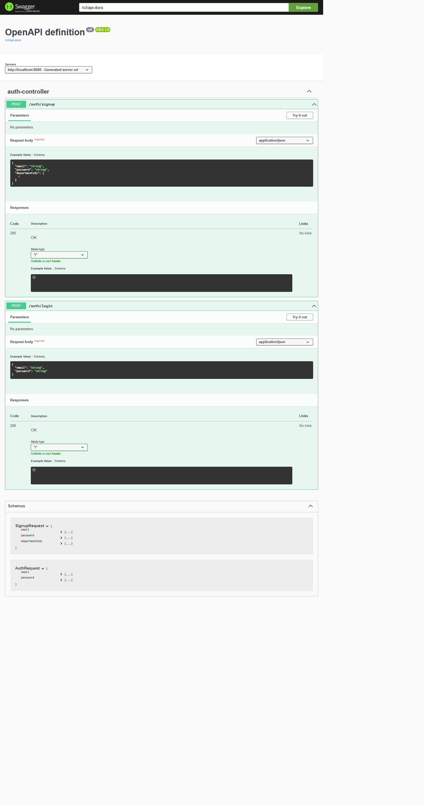

# Auth Service (Spring Boot + JWT)

Small authentication/authorization service built with Spring Boot. It issues JWTs on login and secures endpoints with a stateless filter. Users may belong to one or more departments; the token includes role and department IDs.

## Features
-  Sign up & login with BCrypt-hashed passwords  
-  JWT (HS256) issuance & validation via filter  
-  Role + department claims in token  
-  JPA entities: `User`, `Department`, `UserDepartment` (join)

## Tech Stack
- Java 17+, Spring Boot 3 (Web, Security, Data JPA)  
- PostgreSQL (dev/prod), H2 (tests optional)  
- JJWT (io.jsonwebtoken)

## Quick Start

### 1) Prerequisites
- Java 17+
- Maven or Gradle
- PostgreSQL running (or update the JDBC URL)


### 2) Run
```bash
# Maven
mvn spring-boot:run

# or Gradle
./gradlew bootRun
```

### 3) Smoke test (curl)
```bash
# Sign up (example)
curl -X POST http://localhost:8080/auth/signup   -H "Content-Type: application/json"   -d '{"email":"alice@example.com","password":"pass123","role":"USER","departmentIds":[1,2]}'

# Login
curl -X POST http://localhost:8080/auth/login   -H "Content-Type: application/json"   -d '{"email":"alice@example.com","password":"pass123"}'
# => { "token": "eyJhbGciOi..." }

# Call a secured endpoint
curl http://localhost:8080/api/hello   -H "Authorization: Bearer <paste-token-here>"
```

## API (minimal)
| Method | Path            | Body (JSON)                                | Notes |
|-------:|-----------------|--------------------------------------------|-------|
| POST   | `/auth/signup`  | `{ email, password, role, departmentIds }` | Creates user (+ join rows). Password is hashed. |
| POST   | `/auth/login`   | `{ email, password }`                      | Returns `{ token }` (HS256). |
| *—*    | other routes    | *—*                                        | Require `Authorization: Bearer <token>`. |

**JWT claims** (example):  
```json
{
  "sub": "alice@example.com",
  "role": "USER",
  "departments": [1, 2],
  "iat": 1710000000,
  "exp": 1710086400
}
```

## Project Structure (src only)
```
src/
  main/java/com/example/authservice/
    config/        # SecurityConfig, JwtFilter
    controller/    # AuthController
    dto/           # AuthRequest, SignupRequest
    model/         # User, Department, UserDepartment, CustomUserDetails
    repository/    # UserRepository, DepartmentRepository, UserDepartmentRepository
    service/       # CustomUserDetailsService
    util/          # JwtUtil
  main/resources/  # application.yml
  test/            # (optional)
```

## Development Notes
- Use the `UserDepartment` join entity for user–department relations (avoid CSV fields).  
- Default logging and `ddl-auto` should be relaxed for production (migrations recommended).  
- Ensure `JWT_SECRET` is at least 32 chars for HS256 (`hmacShaKeyFor`).


